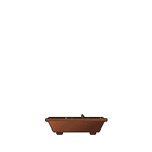

```text
    e   e                    ,e,               e Y8b     888    888       d8
   d8b d8b     ,"Y88b 888,8,  "   ,"Y88b      d8b Y8b    888 ee 888 ee   d88    ,"Y88b 888,8,
  e Y8b Y8b   "8" 888 888 "  888 "8" 888     d888b Y8b   888 P  888 88b d88888 "8" 888 888 "
 d8b Y8b Y8b  ,ee 888 888    888 ,ee 888    d888888888b  888 b  888 888  888   ,ee 888 888
d888b Y8b Y8b "88 888 888    888 "88 888   d8888888b Y8b 888 8b 888 888  888   "88 888 888
```

# Hi, I'm Maria 👋
 
I'm a Software Engineering student at **McMaster University** (Class of 2028). I'm into product engineering, backend and infra, and applied ML and AI.

<picture> <source media="(prefers-color-scheme: dark)" srcset="dist/pet.svg"> <source media="(prefers-color-scheme: light)" srcset="dist/pet-light.svg">  </picture>
 
## What I'm up to
 
- 💼 Interning at PointClickCare
- 🩸 Developing anemia screening models with RBC Borealis
- 🏆 Building at hackathons (Most recently Hack the North 2026)
- 🎹 Teaching myself piano
- 🎾 Taking up tennis

## Experience
 
- 🛍️ **Shopify**: Incoming Software Engineer Intern *(Jan 2027 – Apr 2027)*
- 🏥 **PointClickCare**: AI Automation Engineer Intern *(Sep 2026 – Present)*
- 🏦 **Royal Bank of Canada**: Software Developer Intern *(Jan 2026 – Aug 2026)*
- 📅 **QReserve**: Software Developer Intern *(May 2025 – Aug 2025)*
- 🎓 **McMaster University**: Teaching Assistant *(Sep 2025 – Apr 2026)*
## Tech Stack
 
**Languages**
 


 
**AI / LLM**
 


 
**Frameworks**
 


 
**Tools**
 


<p align="center">  </p>
 
## Let's connect
 
- 💼 LinkedIn: [maria-akhtar-](https://www.linkedin.com/in/maria-akhtar-/)
- 📧 Personal: [mariaakhtar0035@gmail.com](mailto:mariaakhtar0035@gmail.com)
- 🎓 School: [akhtam23@mcmaster.ca](mailto:akhtam23@mcmaster.ca)
- 💬 Discord: mariaakhtar
 
